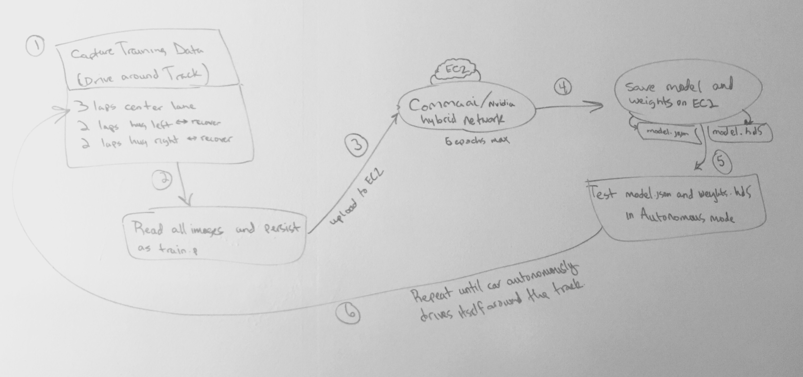
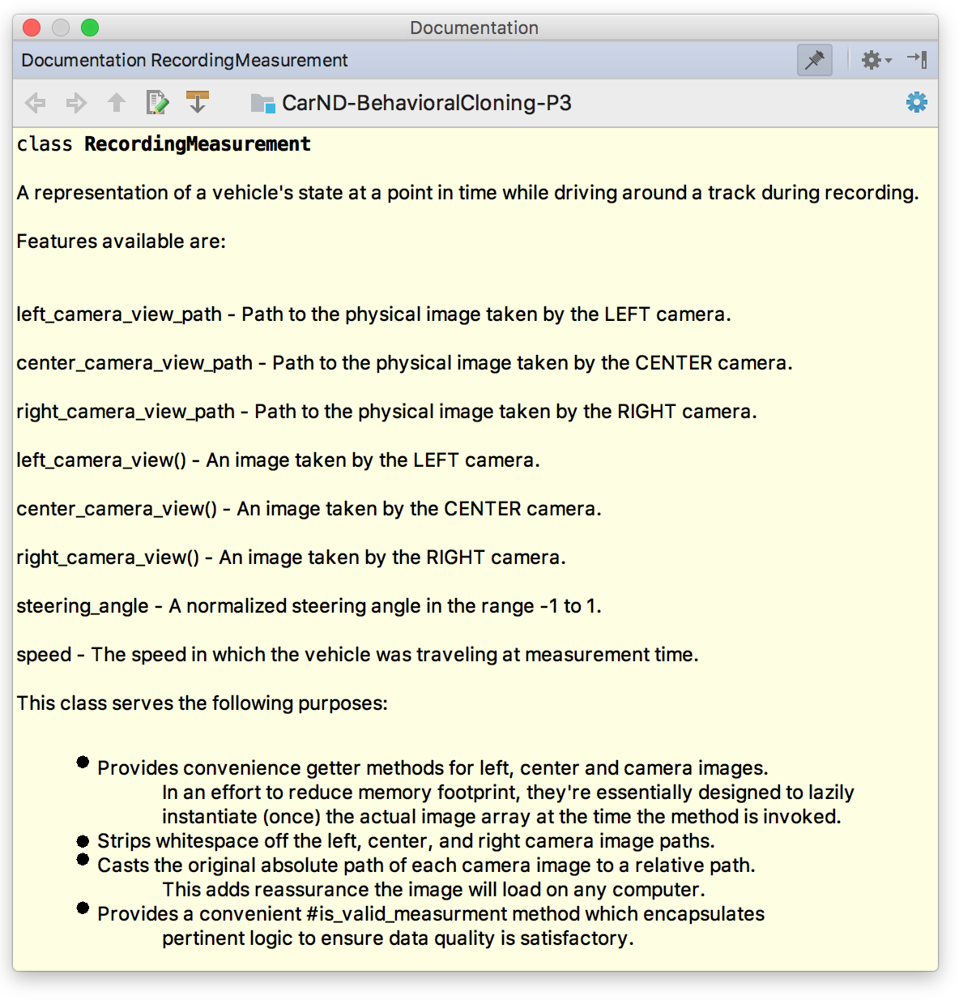

# Behavioral Cloning using Deep Learning
##### A Udacity Self-Driving Car Engineer NanoDegree project

Final submission for Udacity's Self-Driving Car Engineer NanoDegree Behavioral Cloning project.

See [model.ipynb](model.ipynb) for a thorough walk-through of this project including code and visualizations.

**NOTE:** I have yet to successfully generalize to track 2 with my current model, however, I have several hypothesis which I will be testing in the coming weeks in an effort to crack the code.

#### Project Submission Guidelines

For this project, a reviewer will be testing [model.json](model.json) and [model.h5](model.h5) which was generated on the first test track using [model.py](model.py) (the one to the left in the track selection options).

The following naming conventions were used to make it easy for reviewers to find the right files:

* `model.py` - The script used to create and train the model.
* `drive.py` - The script to drive the car. I submitted a modified version of the original drive.py.
* `model.json` - The model architecture.
* `model.h5` - The model weights.
* `README.md` - Explains the structure of my network and training approach.

The rubric for this project may be found [here](https://review.udacity.com/#!/rubrics/432/view).

#### Network Architecture

I present to you in this project my very own convolutional neural network. However, before I arrived at my final architecture, I implemented and trained against several well-know network architectures such as [CommaAI's](https://github.com/commaai/research/blob/master/train_steering_model.py) and [Nvidia's End to End Learning for Self-Driving Cars](http://images.nvidia.com/content/tegra/automotive/images/2016/solutions/pdf/end-to-end-dl-using-px.pdf). While exploring and researching each component used in both of those networks, I learned a lot about the various activation and optimization functions, dropout, etc.

More specifically, here are some resources and academic papers I thoroughly read and digested to ultimately use as inspiration for my final network architecture.

[ReLU vs PRELU](https://arxiv.org/pdf/1502.01852v1.pdf)  
[Fast and Accurate Deep Network Learning by Exponential Linear Units (ELUs)](https://arxiv.org/abs/1511.07289)  
[Dropout](http://www.cs.toronto.edu/~rsalakhu/papers/srivastava14a.pdf)  
[Dropout as explained by Geoffrey Hinton himself](https://www.youtube.com/watch?v=vAVOY8frLlQ)  
[Nvidia's End to End Learning for Self-Driving Cars](http://images.nvidia.com/content/tegra/automotive/images/2016/solutions/pdf/end-to-end-dl-using-px.pdf)  
[Identification of Driver Steering and Speed Control](http://www2.eng.cam.ac.uk/~djc13/vehicledynamics/downloads/Odhams_PhDthesis_Sep06.pdf)  
[Feature Scaling by Andrew Ng](https://youtu.be/aJmorz9gD4g)  

Here is an early diagram I drew on my whiteboard wall in my home office: 

_NOTE_ (2) no longer saves to train.p. My training features are instances of the `RecordingMeasurement` class which hold reference to an image path and lazy instantiate the source image array inside my custom batch generator.

While on the subject of RecordingMeasurement, here is some documentation for this class:

#### Training the Network

##### Gathering Initial Training Data

All training data was collected in the Self-Driving Car simulator on Mac OS using a Playstation 3 controller. 

I recorded myself driving around the track in the center lane approximately 4 times. Once I felt I collected enough training samples (~20k), I rsynced driving_log.csv and all images in the IMG directory to my EC2 GPU instance.

##### Training with Initial Training Data

I trained the network on a g2.2xlarge EC2 instance, saved the model and weights persisted as model.json and model.h5 respectively, `scp`ed model.json and model.h5 to my machine, then tested the model in autonomous mode using `drive.py`.

##### Gathering Recovery Training Data

At each point in autonomous mode where the car vered off in a non-safe manner, I would record recovery data. Before recording, I wiped driving_log.csv clean to collect recovery data only.

##### COMMAND: Train the Network

`$ python3 model.py --nb_epochs 2 --learning_rate 0.001 --use_weights False`

##### COMMAND: Start client to send signals to the simulator in Autonomous Mode

`$ python3 drive.py model.json`

